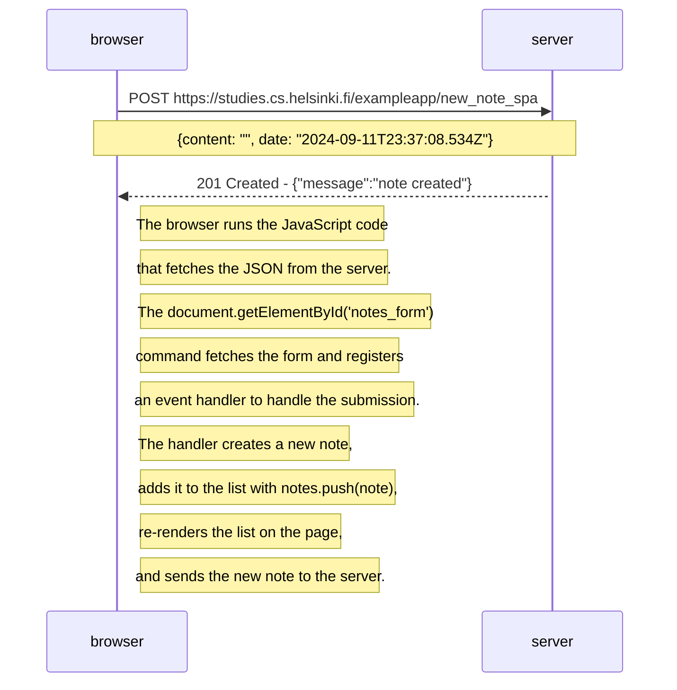

```mermaid
sequenceDiagram

    participant browser
    participant server

    browser->>server: POST https://studies.cs.helsinki.fi/exampleapp/new_note_spa
    Note over browser,server: {content: "", date: "2024-09-11T23:37:08.534Z"}    

    activate server
    server-->>browser: 201 Created - {"message":"note created"}

    Note right of browser: The browser runs the JavaScript code 
    Note right of browser: that fetches the JSON from the server. 
    Note right of browser: The document.getElementById('notes_form') 
    Note right of browser: command fetches the form and registers 
    Note right of browser: an event handler to handle the submission. 
    Note right of browser: The handler creates a new note, 
    Note right of browser: adds it to the list with notes.push(note), 
    Note right of browser: re-renders the list on the page, 
    Note right of browser: and sends the new note to the server.

  
```
