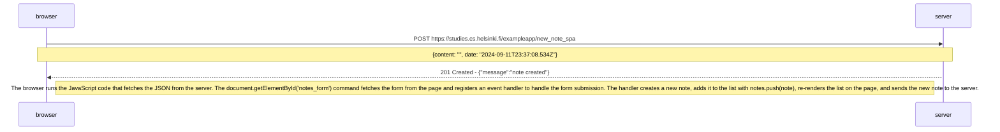

```mermaid
sequenceDiagram

    participant browser
    participant server

    browser->>server: POST https://studies.cs.helsinki.fi/exampleapp/new_note_spa
    Note over browser,server: {content: "", date: "2024-09-11T23:37:08.534Z"}    

    activate server
    server-->>browser: 201 Created - {"message":"note created"}

    Note right of browser: The browser runs the JavaScript code that fetches the JSON from the server. The document.getElementById('notes_form') command fetches the form from the page and registers an event handler to handle the form submission. The handler creates a new note, adds it to the list with notes.push(note), re-renders the list on the page, and sends the new note to the server.

  

  
```
